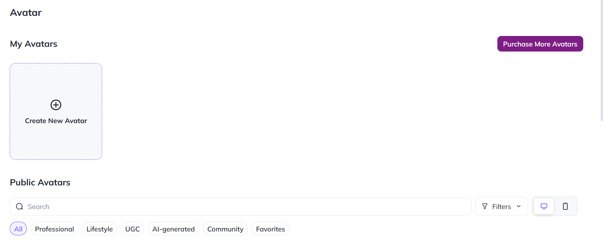
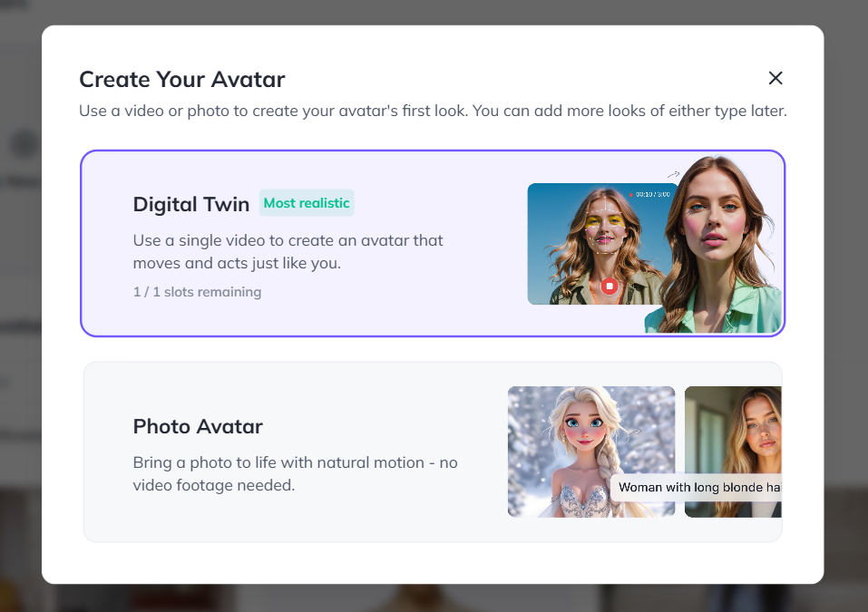
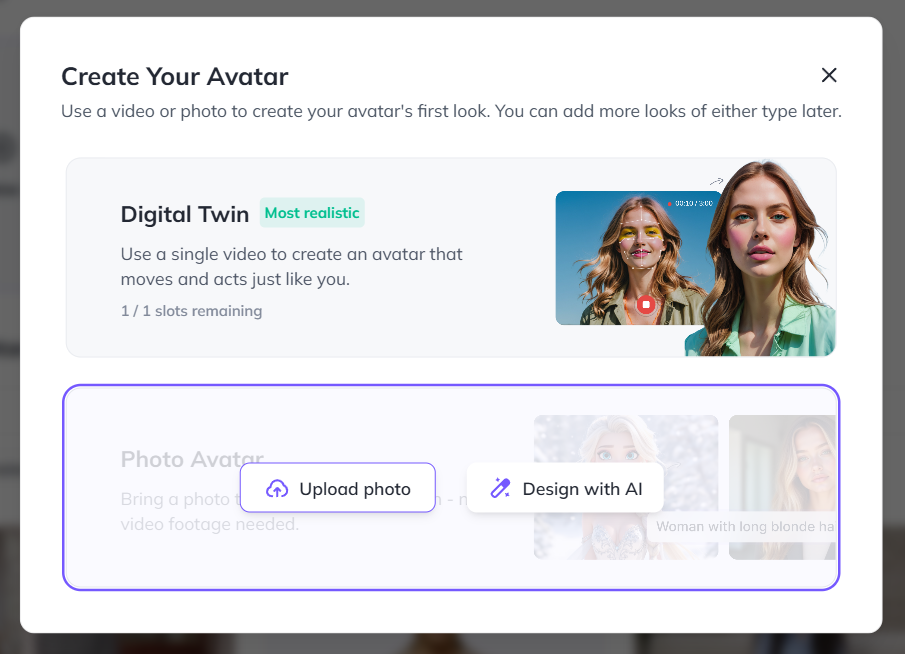
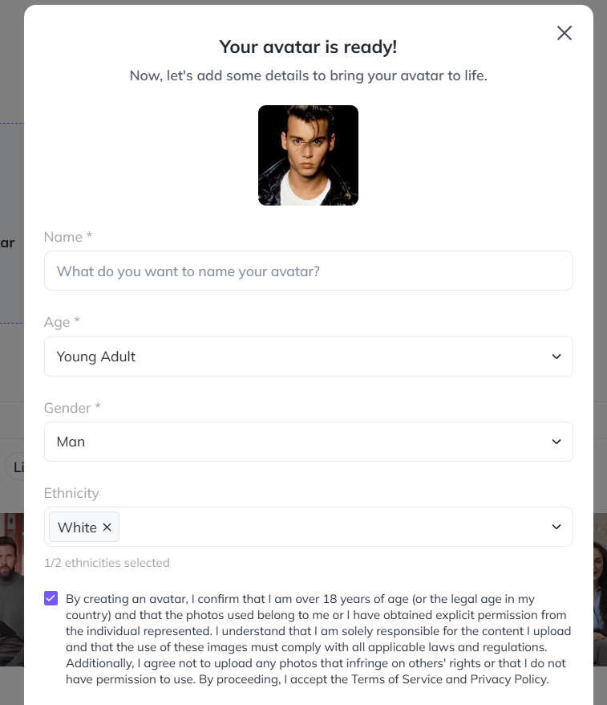
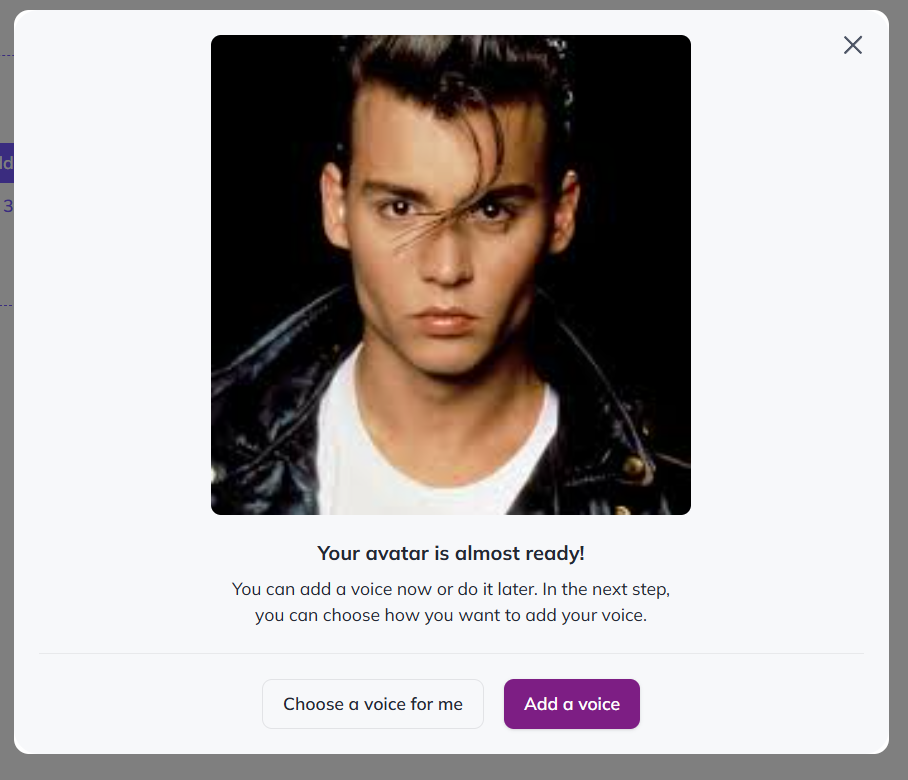
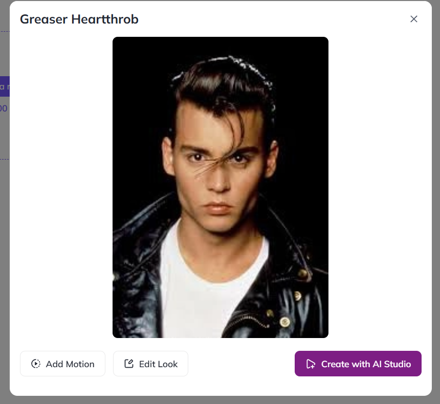
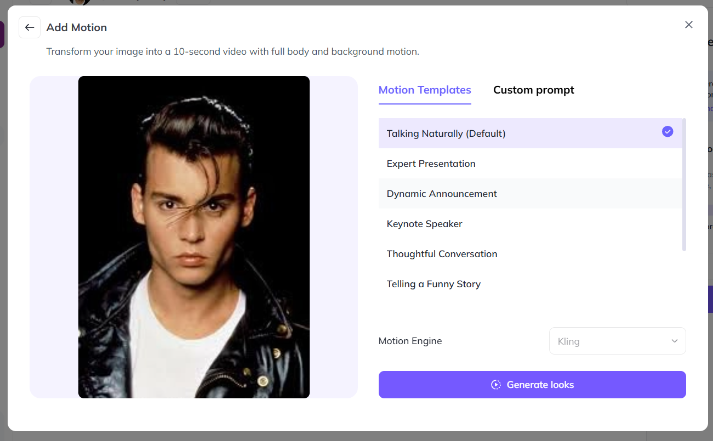
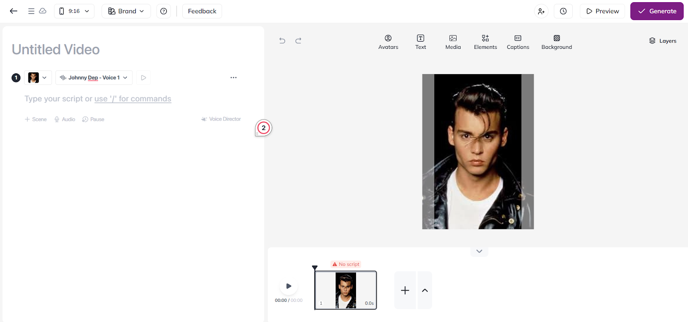
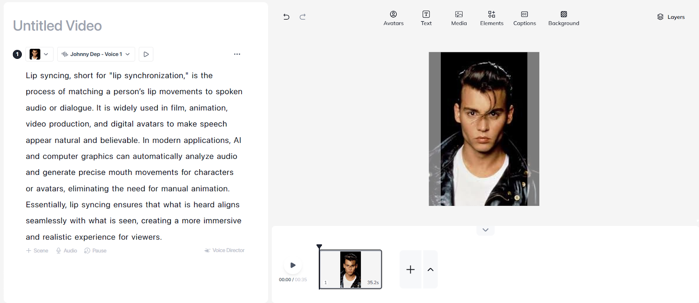
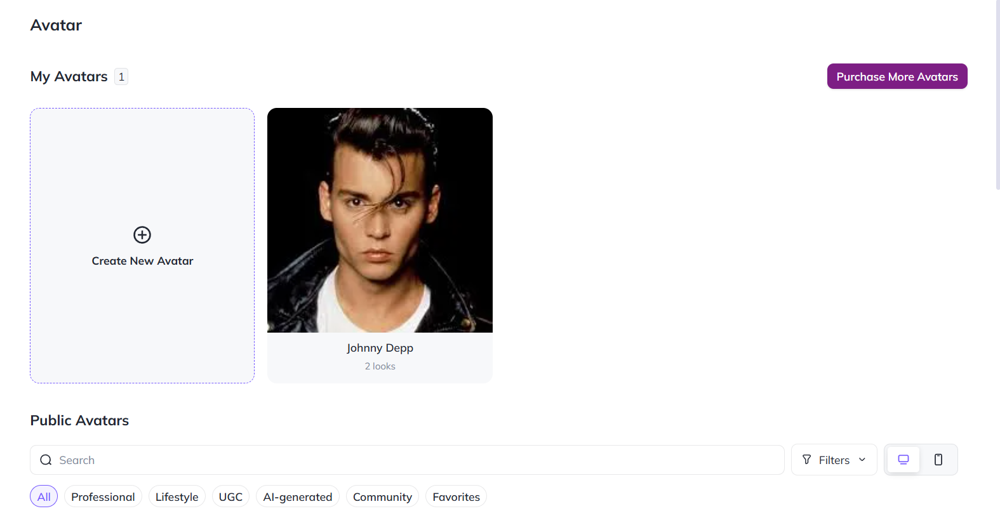

# 🗣️ Lip-Syncing Avatar Builder

> **AI-powered system that transforms avatars into lifelike talking characters with precise lip-sync.**

Synchronizes spoken audio or text-to-speech with realistic mouth movements, making avatars, characters, and videos feel natural and engaging. Perfect for 🎬 films, 🎮 games, 🎓 education, 📢 marketing, and 🖥️ virtual communication.

---

## Samples

<table>
    <tbody>
        <tr>
            <td width="50%">
                
            </td>
            <td width="50%">
                
            </td>
        </tr>
        <tr>
            <td width="50%">
                
            </td>
            <td width="50%">
                
            </td>
        </tr>
        <tr>
            <td width="50%">
                
            </td>
            <td width="50%">
                
            </td>
        </tr>
        <tr>
            <td width="50%">
                
            </td>
            <td width="50%">
                
            </td>
        </tr>
        <tr>
            <td width="50%">
                
            </td>
            <td width="50%">
                
            </td>
        </tr>
        <tr>
            <td width="50%">
                
            </td>
        </tr>
    </tbody>
</table>

## 🎥 Samples

<table>
    <tbody>
        <tr>
            <td width="50%">
                <video src="https://github.com/user-attachments/assets/56be4329-fd3d-4ed7-995e-e18405f9829e" controls preload>
                    Your browser does not support the video tag.
                </video>
            </td>
            <td width="50%">
                <video src="https://github.com/user-attachments/assets/c27ac859-ecd7-451e-9e9e-0d41d9386f0d" controls preload>
                    Your browser does not support the video tag.
                </video>
            </td>
        </tr>
        <tr>
            <td width="50%">
                <video src="https://github.com/user-attachments/assets/6efd6d3a-66bc-4914-8b9c-7611292c8df3" controls preload>
                    Your browser does not support the video tag.
                </video>
            </td>
            <td width="50%">
                <video src="https://github.com/user-attachments/assets/684fcbef-91ce-481e-b9f9-2f786ae88b31" controls preload>
                    Your browser does not support the video tag.
                </video>
            </td>
        </tr>
        <tr>
            <td width="50%">
                <video src="https://github.com/user-attachments/assets/a938d0a2-4d46-4b89-bd9a-8260c72a00f3" controls preload>
                    Your browser does not support the video tag.
                </video>
            </td>
            <td width="50%">
                <video src="https://github.com/user-attachments/assets/71387067-be71-4629-bded-a72150295110" controls preload>
                    Your browser does not support the video tag.
                </video>
            </td>
        </tr>
    </tbody>
</table>

---

## 📊 Full Description

  
📖 Click to expand the Description

### 📝 Overview
The **Lip-Syncing Avatar Builder** is a crucial tool for creating avatars that talk in perfect synchronisation with speech. It aligns spoken or generated audio with corresponding lip movements, producing avatars that convincingly appear to speak.

🌍 **Applications:**
- Content creation & animation
- Gaming & virtual assistants
- Video conferencing & communication platforms

---

### ❌ Problem
- Traditional avatar animation is **time-consuming**, **labour-intensive**, and **error-prone**.
- Limited scalability makes it difficult to create natural, high-quality speaking avatars.

---

### ✅ Solution
The builder automates talking avatar creation using advanced AI:
- Detects **phonemes** from speech
- Generates **accurate lip movement patterns**
- Synchronises seamlessly with audio / TTS
- Cuts production time & cost while boosting realism

---

### ⚙️ Process

#### 🔍 Preprocessing
- Audio feature extraction with **LibROSA**
- Lip landmark detection with **OpenCV**

#### 🧠 Model Selection
- Deep learning (TensorFlow, PyTorch) with **CNNs & Transformers**
- Transfer learning via **VGGish (audio)** + **OpenPose (pose estimation)**

#### 🏋️ Training & Validation
- Pipelines: **TFX / PyTorch Lightning**
- Data augmentation for style & language diversity

#### 📊 Evaluation Metrics
- **MSE** for predicted vs. actual lip positions
- **Phoneme-level accuracy (Jiwer)**
- Perceptual evaluation of audio-video sync

---

### 🏆 Achievements
- 🚀 Adopted across content creation, gaming & education platforms
- 💰 Revenue via licensing, SaaS, and integrations
- 🔗 Integrated into conferencing tools & game engines
- ⚡ Reduced manual animation workload
- 📱 Cross-platform compatibility

---

### 🔮 Future Scope
- 🎭 More natural expressions with **GANs**
- 🎚️ Fine-grained emotional & gesture control
- ⚡ Real-time avatars with **edge computing**
- 🌍 Expanded **language & accent support**
- 🕶️ **AR/VR integration** for immersive avatars
- 🤖 Dynamic learning with user feedback

---

### 📚 References
1. *Deep Lip Reading: A Comparison of Models and an Online Application* – P. Asselin, et al.
2. *LipNet: End-to-End Sentence-level Lipreading* – Y. M. Chung & A. Zisserman
3. *Lip Reading in the Wild* – J. S. Chung & A. Zisserman
4. *Recent Advances in Deep Learning for Audio-Visual Speech Processing* – IEEE Signal Processing Magazine
5. *Speech Synthesis and Lip Sync with Neural Networks* – Distill.pub
6. *Speech and Audio Signal Processing* – Ben Gold & Nelson Morgan
7. *Deep Learning* – Ian Goodfellow, Yoshua Bengio, Aaron Courville
8. *Computer Vision: Algorithms and Applications* – Richard Szeliski

