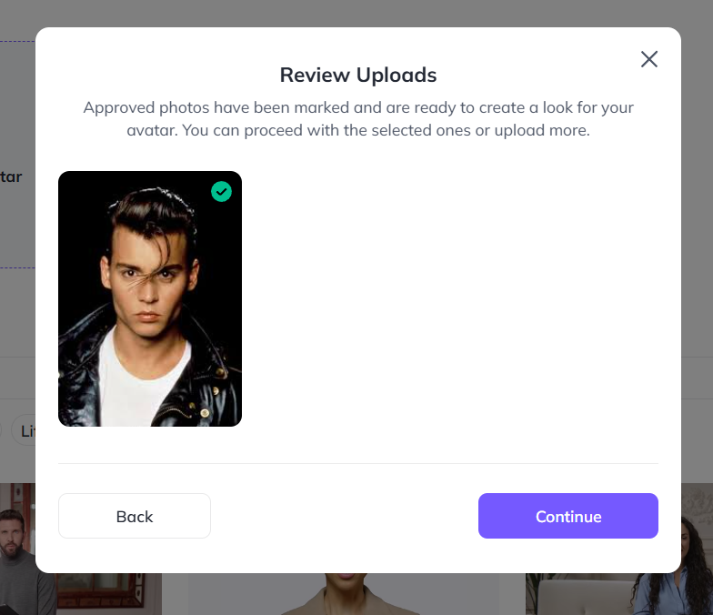

# 👄 Lip Sync Technology

## 🎬 Intro Description
Lip Sync is an **AI-powered technology** that matches spoken audio with realistic mouth movements, making characters, avatars, and videos look natural when they speak.  
Instead of relying on slow manual animation, the system uses **advanced models** to automatically align voices with lip movements.  
✨ This creates smoother, more engaging results for films, games, social media, and virtual communication.

👉 From improving animated movies to making avatars in video calls feel more lifelike, **Lip Sync bridges the gap between voice and visuals.**

## Examples

<table>
    <tbody>
        <tr>
            <td width="50%">
                
            </td>
            <td width="50%">
                
            </td>
        </tr>
        <tr>
            <td width="50%">
                
            </td>
            <td width="50%">
                
            </td>
        </tr>
        <tr>
            <td width="50%">
                
            </td>
            <td width="50%">
                
            </td>
        </tr>
        <tr>
            <td width="50%">
                
            </td>
            <td width="50%">
                
            </td>
        </tr>
        <tr>
            <td width="50%">
                
            </td>
            <td width="50%">
                
            </td>
        </tr>
        <tr>
            <td width="50%">
                
            </td>
        </tr>
    </tbody>
</table>

## 🎥 Video Examples

<table>
    <tbody>
        <tr>
            <td width="50%">
                <video src="https://github.com/user-attachments/assets/f358b87c-ed5b-4e87-b13b-f43ea0ed8d2f" controls preload>
                    Your browser does not support the video tag.
                </video>
            </td>
            <td width="50%">
                <video src="https://github.com/user-attachments/assets/9a700acd-c297-47d9-b746-72d183a07c60" controls preload>
                    Your browser does not support the video tag.
                </video>
            </td>
        </tr>
        <tr>
            <td width="50%">
                <video src="https://github.com/user-attachments/assets/a2ffa9d4-6258-4bce-be40-69de52f36391" controls preload>
                    Your browser does not support the video tag.
                </video>
            </td>
            <td width="50%">
                <video src="https://github.com/user-attachments/assets/ca060618-b998-49ed-bf40-e2b6f2e52dfe" controls preload>
                    Your browser does not support the video tag.
                </video>
            </td>
        </tr>
        <tr>
            <td width="50%">
                <video src="https://github.com/user-attachments/assets/ded4aa8a-a66b-423c-8522-3da4ea3c7d1b" controls preload>
                    Your browser does not support the video tag.
                </video>
            </td>
            <td width="50%">
               <video src="https://github.com/user-attachments/assets/04be1d2f-4774-4142-85a4-a181725c5507" controls preload>
                    Your browser does not support the video tag.
                </video>
            </td>
        </tr>
    </tbody>
</table>

<table>
    <tbody>
        <tr>
            <td width="50%">
                <video src="https://github.com/user-attachments/assets/ffd46a5f-643c-4f1f-b6a5-a721af5f5de7" controls preload>
                    Your browser does not support the video tag.
                </video>
            </td>
            <td width="50%"></td>
        </tr>
    </tbody>
</table>

<table>
    <tbody>
        <tr>
            <td width="50%">
                <video src="https://github.com/user-attachments/assets/684fcbef-91ce-481e-b9f9-2f786ae88b31" controls preload>
                    Your browser does not support the video tag.
                </video>
            </td>
            <td width="50%"></td>
        </tr>
    </tbody>
</table>

---

## 📊 Full Description

  
📖 Click to expand the Description

### 📌 Overview
Lip syncing technology is a crucial aspect of **audiovisual synchronisation**, involving the precise alignment of spoken or sung words with corresponding lip movements.  
🎥 Widely applied in the **entertainment industry**—film, television, and video production—it ensures that characters appear to speak naturally.  
It extends to **animation, gaming, and virtual avatars**, making interactions more engaging and lifelike.

### ⚠️ Problem
Industries like 🎞️ film, 🎮 gaming, and 💻 communication demand **accurate lip syncing** for realistic experiences.  
But manual approaches are:
- ⏳ Time-consuming
- 💪 Labour-intensive
- ❌ Error-prone

This inefficiency reduces authenticity in audiovisual content.

### 💡 Solution
AI-powered **Lip Syncing technology** automates synchronisation:
- 🤖 Aligns spoken words with lips dynamically
- 🚀 Reduces manual effort
- 🎯 Ensures smooth, realistic audiovisual experiences

Powered by **deep learning algorithms**, it analyses audio & generates precise lip movement patterns.

---

## 🔄 Process

1. **🎧 Preprocessing**
   - LibROSA → Audio feature extraction
   - OpenCV → Facial landmark detection
   - Noise reduction via TensorFlow Audio Effects

2. **🧠 Model Selection**
   - TensorFlow & PyTorch → CNNs, RNNs, Transformers
   - Transfer learning: OpenPose, VGGish

3. **⚙️ Training & Validation**
   - Data augmentation (Keras ImageDataGenerator)
   - Hyperparameter tuning (scikit-learn)
   - Pipelines: TFX, PyTorch Lightning

4. **📏 Evaluation Metrics**
   - MSE (Mean Squared Error)
   - Phoneme-level accuracy (Jiwer)
   - Visual & auditory evaluation (PyDub + OpenCV)

---

## 🏆 Achievements

- 👥 **User Adoption** → Broad industry usage
- 💰 **Monetary Impact** → Licensing, partnerships, revenue growth
- 🔗 **Integration** → Adopted by leading content platforms & engines
- 🎉 **Industry Disruption** → Reduced manual animation hours, boosted production efficiency
- 🌍 **Cross-Platform Compatibility** → Works across devices, OS, and frameworks

---

## 🚀 Future Scope

- 🤖 **Generative Models (GANs)** → Enhance realism
- 🔗 **Cross-Modal Integration** → Better audio-visual sync
- ⚡ **Edge Computing** → Low latency, real-time use
- 🎭 **Fine-Grained Control** → More creative freedom for expressions
- 🌐 **Multi-Language & Accent Support** → Broader inclusivity
- 📊 **Quality Metrics** → Standardised perceptual accuracy measures
- 🔄 **Interactive Learning** → Adaptive sync from feedback
- 🥽 **AR & VR Integration** → Lifelike avatars in immersive worlds

---

## 📚 References

- 📖 *Deep Lip Reading: A Comparison of Models and an Online Application* — P. Asselin, et al.
- 📖 *LipNet: End-to-End Sentence-level Lipreading* — Y. M. Chung, A. Zisserman
- 📖 *Lip Reading in the Wild* — J. S. Chung, A. Zisserman
- 📖 *Recent Advances in Deep Learning for Audio-Visual Speech Processing* — IEEE Signal Processing Magazine
- 📖 *A Comprehensive Review on Lipreading Approaches: Recent Advances and Challenges* — Journal of Visual Communication and Image Representation
- 📖 *Speech Synthesis and Lip Sync with Neural Networks* — Distill.pub
- 📖 *Speech and Audio Signal Processing* — Ben Gold, Nelson Morgan
- 📖 *Deep Learning* — Ian Goodfellow, Yoshua Bengio, Aaron Courville
- 📖 *Computer Vision: Algorithms and Applications* — Richard Szeliski  

